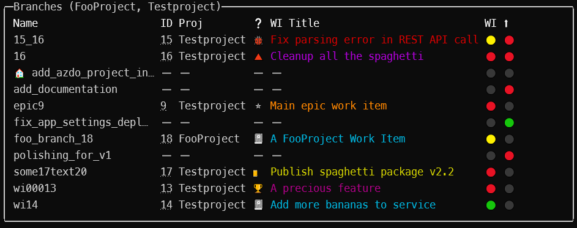
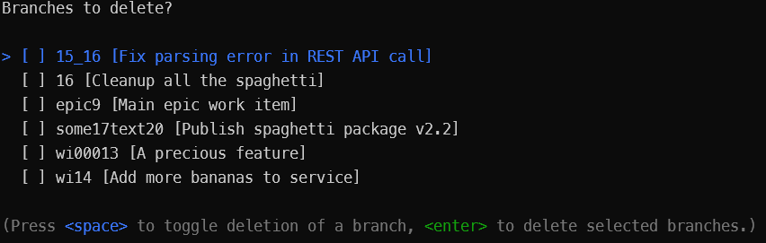

# Develix.RepoCleaner

## Introduction

This is designed to helps to keep track of git branches and their azure devops work items.

## Installation & Configuration

- Extract the release zip file to any folder
- Add the "install" folder to your path environment variables
- Edit `appSettings.json` in the "install folder" and enter your `AzureDevopsOrgUri` (where your work items are stored)
- Start `RepoCleaner.exe config` to enter _config mode_ and enter an azure devops personal access token that has at least _Work Items_ and _Code_ read access
- [Configure you powershell to use UTF8 encoding](docs/doc.md#powershell), otherwise some icons will not be able to be displayed

## Quick Usage

### Overview

```ps
# Start the tool
RepoCleaner.exe
```

This command will show all local branches and the related work item of this branch. The work item number is determined by the first number found in the branch name.



### Clean up

```ps
# Start the tool with delete parameter
RepoCleaner.exe -d
```

This commands shows the [overview](#overview) and a delete prompt for all branches that can be deleted.



### More

Read the detailed documentation or start the tool with the _help_ parameter.

```ps
# Start the tool with help parameter
RepoCleaner.exe -h
```

## Documentation

Read the [documentation](docs/doc.md).
