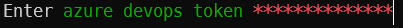

# RepoCleaner Documentation

## Installation

Extract the [release zip file](https://github.com/FelixDamrau/Develix.RepoCleaner/releases) to any folder. Add this folder to your local path variables, so the tool can be started easily.

When updating, be sure not to overwrite your `appSettings.json`.

## Configuration

### appSettings.json

| Property          | Description                                           |
| ----------------- | ----------------------------------------------------- |
| AzureDevopsOrgUri | The URI of your azure devops organization.            |
| ExcludedBranches  | Regex pattern for branches that will not be displayed |

### Azure Devops Token

To access work items and code on a azure devops server add an azure devops personal access token with at least _work items_ and _code_ read scope.

The token will be stored locally on your computer as a generic Windows credential with the name _Develix:RepoCleanerAzureDevopsToken_.

```ps
RepoCleaner.exe --config
```



### Powershell

RepoCleaner should be used with PowerShell 7. Be sure to set the encoding to UTF8.

To do that, add the following line to your PowerShell profile (`$PROFILE`).

```ps
[console]::InputEncoding = [console]::OutputEncoding = [System.Text.UTF8Encoding]::new()
```

## Features

### Show Local Branches and Work Items

```ps
RepoCleaner.exe
```


| Number | Explanation                                               |
| ------ | --------------------------------------------------------- |
| 1      | The name of the git branch                                |
| 2      | The parsed work item id (Links to azure devops work item) |
| 3      | The icon of the related azure devops work item type       |
| 4      | The title of the related azure devops work item           |
| 5      | The status of the related azure devops work item          |
| 6      | The upstream status of the git branch                     |
| 7      | The icon indicates the currently checked out branch       |

#### Work Item Types

| Icon | Work Item Type       | Color  |
| ---- | -------------------- | ------ |
| ⭐   | Epic                 | Orange |
| 🐞   | Bug                  | Red    |
| 🏆   | Feature              | Pink   |
| 📓   | Product Backlog Item | Blue   |
| 🔺   | Impediment           | Purple |
| 🗒    | Task                 | Yellow |

#### Work Item Status

| Color | Status                                 |
| ----- | -------------------------------------- |
| 🟢    | Work item is in a _done_ status        |
| 🟡    | Work item is in a _precessing_ status  |
| 🔴    | Work item is in a _not started_ status |
| ⚫    | No work item found                     |

#### Upstream Status

| Color | Status                                                    |
| ----- | --------------------------------------------------------- |
| 🟢    | Upstream is active                                        |
| 🔴    | Upstream is set locally, but the remote branch is deleted |
| ⚫    | No upstream set                                           |

### Delete Branches

```ps
RepoCleaner.exe -d
```

Select all branches that should be deleted and press enter.


### Specify Git Repository Path

By default, RepoCleaner displays information about the branch in the current directory. To override this specify a path the local git repository you want information about.

```ps
RepoCleaner.exe --path "C:\My Wonderful Code\A Git Repository"
```

### More Overview Information

#### Author Information

```ps
RepoCleaner.exe --author
```

The overview will also show the the author of the latest commit of each branch.


