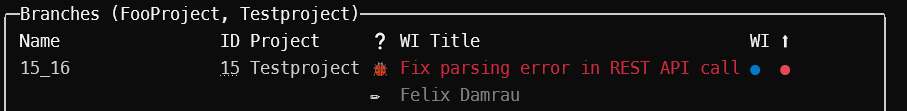

# RepoCleaner Documentation

## Installation

Extract the [release zip file](https://github.com/FelixDamrau/Develix.RepoCleaner/releases)
to any folder. Add this folder to your local path variables, so the tool can
be started easily.

## Configuration

### repo-cleaner.yml

Run `RepoCleaner config` to open the configuration file in your editor.
The file will be created in the `%LOCALAPPDATA/RepoCleaner`-folder,
if it does not exist yet.

#### GitHandler

At present, this tool employs the LibGit2Sharp library to manage all Git
operations. Regrettably, this library may induce issues on certain systems.
If you face obstacles, you can adjust the setting to External or FileSystem.

The File System Git Handler employs the file system to interpret Git-related
details but does not accommodate the --author and --delete command options.

Conversely, the External Git Handler leverages a pre-installed Git for
Windows, executing git.exe processes to handle Git-related tasks. If any tabs
are detected in the required properties, this handler may falter in parsing
the git.exe output.

Right now the External Git Handler is the default handler.

#### ShortProjectNames

This section allows to shorten project names. See the following example for details

```yml
short-project-names:
  LongProjectName: LPN
```

Whenever a project with the name _ProjectName_ (case-invariant) is found, it will
be displayed as _PN_ in the overview table. The shortened project name can be a
[Spectre.Console markup string](https://spectreconsole.net/markup).
For example: `[bold red]PN[/]`, will display a bold and red text _Foo_.

#### WorkItemTypeIcons

This section defines icons for work item types. See the following example for details

```yml
work-item-type-icons:
  Bug: ':lady_beetle:'
```

Whenever a work item with the type name _Bug_ (case-invariant) is found, it will
be displayed with the given markup (🐞) in the overview table. The icon can be a
[Spectre.Console markup string](https://spectreconsole.net/markup) like in this example.  
If no item is found, the fallback icon (❓) is used.

### Azure DevOps Token

To access work items and code on an Azure DevOps server add an Azure DevOps personal
access token with at least _work items_ and _code_ read scope.

Add the token to the configuration file of this tool (via `RepoCleaner config`) or
add an environment variable with the token as value (default name: `REPOCLEANER_AZDO_TOKEN``)

### Powershell

RepoCleaner should be used with PowerShell 7. Be sure to set the encoding to UTF8.

To do that, add the following line to your PowerShell profile (`$PROFILE`).

```ps
[console]::InputEncoding = [console]::OutputEncoding = [System.Text.UTF8Encoding]::new()
```

## Features

### Show Local Branches and Work Items

```ps
RepoCleaner.exe
```


| Number | Explanation                                               |
| ------ | --------------------------------------------------------- |
| 1      | The name of the git branch                                |
| 2      | The parsed work item id (Links to Azure DevOps work item) |
| 3      | The Azure DevOps team project of the related work item    |
| 4      | The icon of the related Azure DevOps work item type       |
| 5      | The title of the related Azure DevOps work item           |
| 6      | The status of the related Azure DevOps work item          |
| 7      | The upstream status of the git branch                     |
| 8      | The icon indicates the currently checked out branch       |

#### Team Project

The team project column is only shown if more than one team project is referenced
by the related work items. All team projects are always shown in the overview
table header.

#### Work Item Types

The work item types have associated icons. See the section
[WorkItemTypeIcons](#workitemtypeicons) for details.

The work item determines the color of the title. The colors are taken from the
Azure Boards work item type.

#### Work Item Status

The work item status has the same color as the Azure Boards work item status.

The default colors are approximately

| Color | Status                                 |
| ----- | -------------------------------------- |
| ⚪    | Work item is in a _not started_ status |
| 🔵    | Work item is in a _processing_ status  |
| 🟢    | Work item is in a _done_ status        |
| ⚫    | No work item found                     |

#### Upstream Status

| Color | Status                                                    |
| ----- | --------------------------------------------------------- |
| 🟢    | Upstream is active                                        |
| 🔴    | Upstream is set locally, but the remote branch is deleted |
| ⚫    | No upstream set                                           |

### Delete Branches

```ps
RepoCleaner.exe -d
```

Select all branches that should be deleted and press enter.


### Specify Git Repository Path

By default, RepoCleaner displays information about the branch in the current
directory. To override this specify a path the local git repository you want
information about.

```ps
RepoCleaner.exe --path "C:\My Wonderful Code\A Git Repository"
```

### Select Branch Source

By default, the branches of the local git repository are displayed in the
overview. This behavior can be overridden with the _branch_ parameter.

```ps
# Get all remote branches
RepoCleaner.exe --branch remote
```

| Parameter | Explanation                                   |
| --------- | --------------------------------------------- |
| Local     | Default behavior, get local branches          |
| Remote    | Get branches of all remote repositories       |
| All       | Get branches of local and remote repositories |

### More Overview Information

#### Author Information

```ps
RepoCleaner.exe --author
```

The overview will also show the author of the latest commit of each branch.



#### Pull Request Information

```ps
RepoCleaner.exe --pr
```

The overview will also show the pull requests that are linked with a
Azure Boards work item. The status of the pull request is shown in the
default Azure Repos colors.

The default colors are approximately

| Color | Status    |
| ----- | --------- |
| 🔵    | Active    |
| 🟢    | Completed |
| ⚫    | Abandoned |


