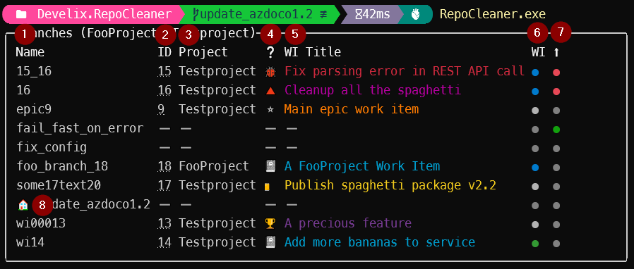

# RepoCleaner Documentation

> **NOTE:** This repository is archived. The successor is [cazdo](https://github.com/FelixDamrau/cazdo).

## Installation

Extract the [release zip file](https://github.com/FelixDamrau/Develix.RepoCleaner/releases) to any folder. Add this folder to your local path variables, so the tool can be started easily.

When updating, be sure not to overwrite your `appSettings.json`.

## Configuration

### appSettings.json

| Property          | Description                                           |
| ----------------- | ----------------------------------------------------- |
| AzureDevopsOrgUri | The URI of your azure devops organization             |
| ExcludedBranches  | Regex pattern for branches that will not be displayed |
| GitHandler        | Specify the way this tool utilizes git                |
| ShortProjectNames | A dictionary for shortened project names              |
| WorkItemTypeIcons | A dictionary for icons for work item types            |

#### GitHandler

This tool uses the library `LibGit2Sharp` to handle all git-related stuff. Unfortunately, this library can cause exceptions one some systems. If you encounter exceptions with this tool set the value to `External` or `FileSystem`.  
The _file system_ git handler utilizes the file system to read git related information. However, it does not support the `--author` and the `--delete` command options.  
The _external_ git handler tries to utilize an installed git for windows and runs `git.exe` processes to handle the git-related stuff. This handler parses the `git.exe` output and will fail horribly if there any and tabs in the required properties.

#### ShortProjectNames

This section allows to shorten project names. See the following example for details

```json
{
  "ShortProjectNames": {
    "ProjectName": "PN"
  }
}
```

Whenever a project with the name _ProjectName_ (case-invariant) ist found, it will be displayed as _PN_ in the overview table. The shortened project name can be a [Spectre.Console markup string](https://spectreconsole.net/markup). For example: `[bold red]PN[/]`, will display a bold and red text _Foo_.

#### WorkItemTypeIcons

This section defines icons for work item types. See the following example for details

```json
{
  "WorkItemTypeIcons": {
    "Bug": ":lady_beetle:"
  }
}
```

Whenever a work item with the type name _Bug_ (case-invariant) ist found, it will be displayed with the given markup (🐞) in the overview table. The icon can be a [Spectre.Console markup string](https://spectreconsole.net/markup) like in this example.  
If no item is found, the fallback icon (❓) is used.

### Azure Devops Token

To access work items and code on a azure devops server add an azure devops personal access token with at least _work items_ and _code_ read scope.

The token will be stored locally on your computer as a generic Windows credential with the name _Develix:RepoCleanerAzureDevopsToken_.

```ps
RepoCleaner.exe config
```


### Powershell

RepoCleaner should be used with PowerShell 7. Be sure to set the encoding to UTF8.

To do that, add the following line to your PowerShell profile (`$PROFILE`).

```ps
[console]::InputEncoding = [console]::OutputEncoding = [System.Text.UTF8Encoding]::new()
```

## Features

### Show Local Branches and Work Items

```ps
RepoCleaner.exe
```



| Number | Explanation                                               |
| ------ | --------------------------------------------------------- |
| 1      | The name of the git branch                                |
| 2      | The parsed work item id (Links to azure devops work item) |
| 3      | The azure devops team project of the related work item    |
| 4      | The icon of the related azure devops work item type       |
| 5      | The title of the related azure devops work item           |
| 6      | The status of the related azure devops work item          |
| 7      | The upstream status of the git branch                     |
| 8      | The icon indicates the currently checked out branch       |

#### Team Project

The team project column is only shown if more than one team project is referenced by the related work items. All team projects are always shown in the overview table header.

#### Work Item Types

The work item types have associated icons. See the section [WorkItemTypeIcons](#workitemtypeicons) for details.

The work item determines the color of the title. The colors are taken from the Azure Boards work item type.

#### Work Item Status

The work item status has the same color as the Azure Boards work item status.

The default colors are approximately

| Color | Status                                 |
| ----- | -------------------------------------- |
| ⚪    | Work item is in a _not started_ status |
| 🔵    | Work item is in a _processing_ status  |
| 🟢    | Work item is in a _done_ status        |
| ⚫    | No work item found                     |

#### Upstream Status

| Color | Status                                                    |
| ----- | --------------------------------------------------------- |
| 🟢    | Upstream is active                                        |
| 🔴    | Upstream is set locally, but the remote branch is deleted |
| ⚫    | No upstream set                                           |

### Delete Branches

```ps
RepoCleaner.exe -d
```

Select all branches that should be deleted and press enter.


### Specify Git Repository Path

By default, RepoCleaner displays information about the branch in the current directory. To override this specify a path the local git repository you want information about.

```ps
RepoCleaner.exe --path "C:\My Wonderful Code\A Git Repository"
```

### Select Branch Source

By default, the branches of the local git repository are displayed in the overview. This behavior can be overridden with the _branch_ parameter.

```ps
# Get all remote branches
RepoCleaner.exe --branch remote
```

| Parameter | Explanation                                   |
| --------- | --------------------------------------------- |
| Local     | Default behavior, get local branches          |
| Remote    | Get branches of all remote repositories       |
| All       | Get branches of local and remote repositories |

### More Overview Information

#### Author Information

```ps
RepoCleaner.exe --author
```

The overview will also show the the author of the latest commit of each branch.


#### Pull Request Information

```ps
RepoCleaner.exe --pr
```

The overview will also show the pull requests that are linked with a Azure Boards work item.
The status of the pull request is shown in the default azure repos colors.

The default colors are approximately

| Color | Status    |
| ----- | --------- |
| 🔵    | Active    |
| 🟢    | Completed |
| ⚫    | Abandoned |


